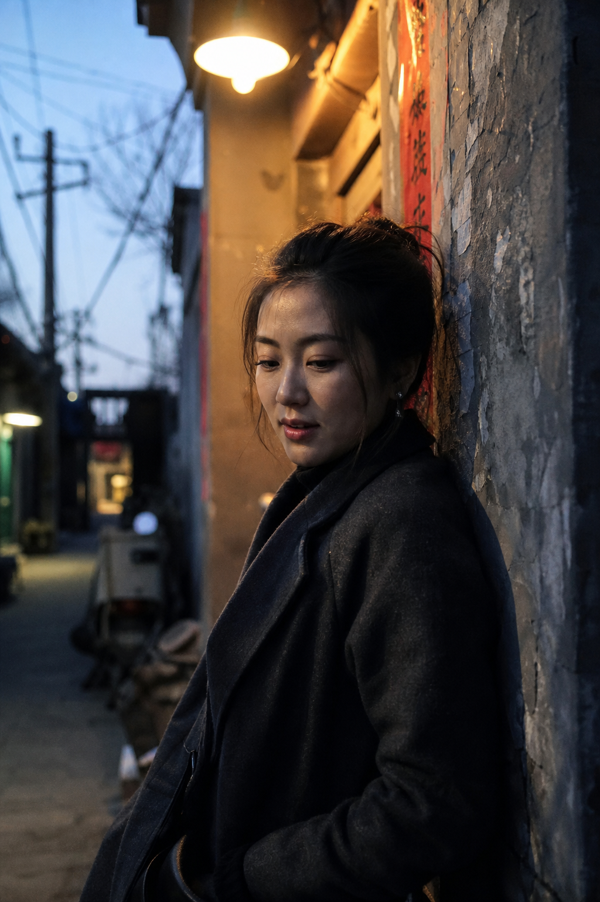
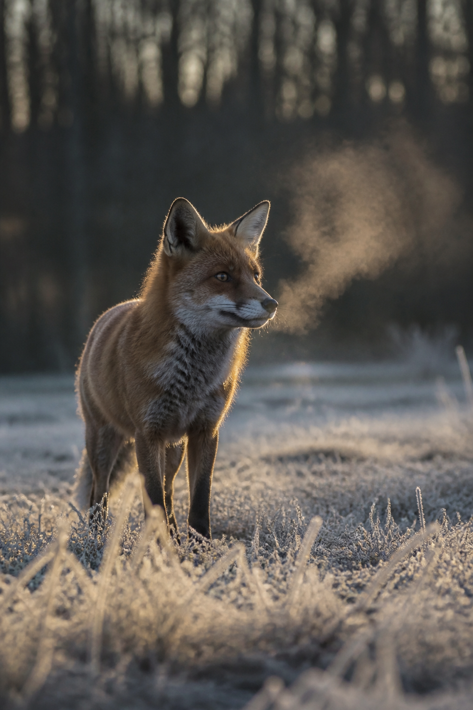
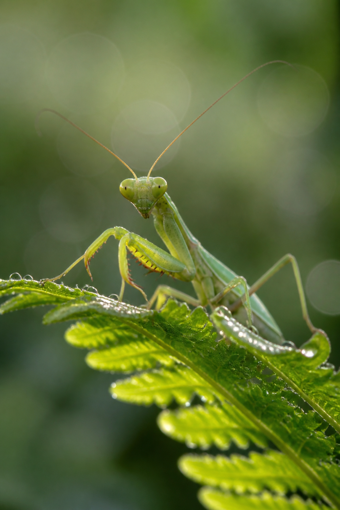
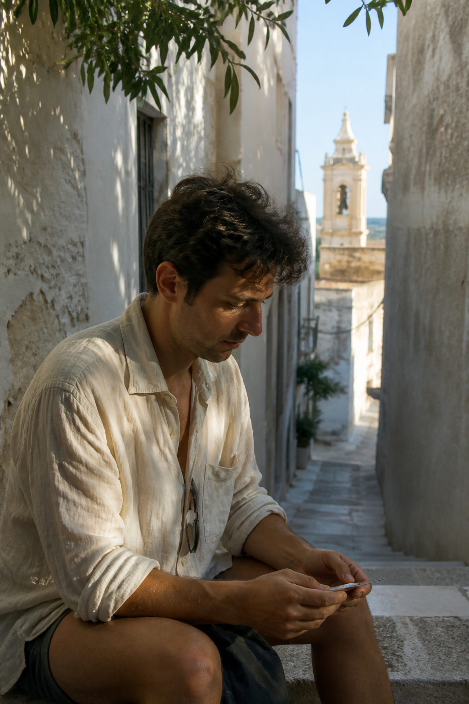
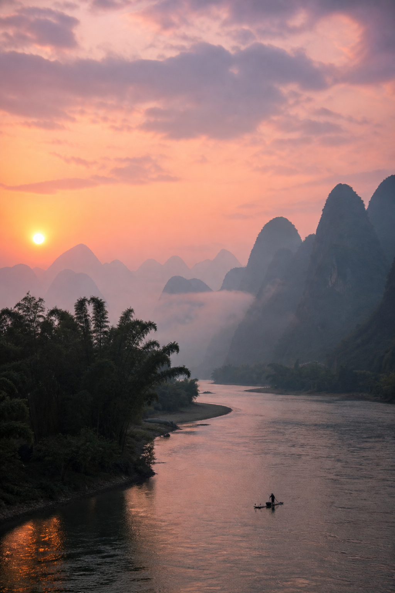

# Hermes 每日生图训练

> AI 生成的照片，要像照片——不是 AI 画。

一套经过实战验证的 AI 生图提示词方法论。**9 种风格，9 投 9 中。** 基于 [Hermes Agent](https://hermes-agent.nousresearch.com) + OpenAI Codex (gpt-image-2-high) + xAI Grok。


> 📌 **项目活跃维护中**：每天上午/下午两场 AI 生图训练，规则随真实产出反馈持续迭代，最新变更见 [CHANGELOG.md](CHANGELOG.md)。

[English version below](#english)

---

## 问题

我们收藏了 **894 条精选 prompt**（含 MiraiVFX 写实 98 条、插画手绘 40 条、艺术摄影 25 条）、348 条专业摄影参考、全套摄影大师技巧。**知识越多，图越差。**

| 以前的写法 | 结果 |
|---|---|
| "Gregory Crewdson 电影感舞台调度" | 塑料感、摆拍、AI 味 |
| "Rembrandt 三角光 + Kodak Portra 400" | 糊片、假、找不到感觉 |
| "Sebastião Salgado 力量纪实" | 皮肤假、太假、恐怖谷 |

## 发现

**AI 不理解艺术史——它理解相机物理。**

你说"Annie Leibovitz 戏剧性肖像"，模型画的是「一幅 Leibovitz 风格的作品」——经过风格化、二手诠释。

你说"Canon EOS R5, 85mm f/1.2, ISO 800, 单灯柔光箱 45°"，模型渲染的是物理约束：f/1.2 的浅景深、ISO 800 的干净噪点、45° 柔光箱的单侧软阴影。

**不要给 AI 当艺术指导。给它租一支镜头。**

---

## 核心公式

```
[ 场景+人物 ] + [ 自然光线 ] + [ 相机+镜头+ISO ] + [ 皮肤/纹理细节 ] + [ 纪实风格声明 ]

⛔ 永不用：摄影师名字、cinematic、editorial、staged、胶片型号
✅ 必须写：相机型号、焦段、光圈、ISO、自然光描述
```

## 三层分离架构

```
┌─────────────────────────────────────────┐
│ 第一层：生成 prompt（给 AI 看，≤150 字）  │
│ 场景+光线+相机+皮肤+负向词                │
│ ⛔ 不含大师名、胶片名、电影感              │
├─────────────────────────────────────────┤
│ 第二层：知识库（Agent 自己看）             │
│ 894条prompt、拉鲁斯资料、大师技巧全集       │
│ → Agent 翻译成第一层语言再写入 prompt      │
├─────────────────────────────────────────┤
│ 第三层：负向词（给 AI 看）                 │
│ 只告诉 AI「不要什么」，不管它「怎么做」     │
└─────────────────────────────────────────┘
```

**894 条 prompt 不是指令——是灵感。** Agent 从中选题、构图，翻译成镜头参数语言喂给模型。

---

## 9 种已验证风格

2026-08-05 全天验证，全部一次出图，零重试。

### 人像/人物

| # | 风格 | 镜头+ISO | 光线 | 适用 |
|---|------|---------|------|------|
| 1 | 新闻纪实 | R5 85/1.2, ISO 800-1600 | 窗光、阴天、钨丝灯 | 街拍、纪录、写实 |
| 2 | 商业时装 | Hasselblad 80/1.9, ISO 100 | 北向窗、间接日光 | 干净高级、产品+模特 |
| 3 | 旅行人文 | Leica M11 35/1.4, ISO 400-800 | 午后阳光透树叶 | 国家地理感 |
| 5 | 街头快照 | Ricoh GR III 28/2.8, ISO 1600-3200 | 城市混合光、无闪 | 粗粝真实、森山味 |
| 6 | 棚拍肖像 | R5 50/1.2, ISO 100 | 单灯柔光箱 45°、白背景 | 专业头像 |

### 自然/动物

| # | 风格 | 镜头+ISO | 光线 | 适用 |
|---|------|---------|------|------|
| 4 | 极简风光 | Sony 24/1.4, ISO 100, 三脚架 | 黎明前长曝光 30s | 静谧大气 |
| 7 | 自然风光 | Sony 24-70/2.8@35, ISO 200 | 晨雾、第一缕光 | 山水、大景 |
| 8 | 野生动物 | Sony 400/2.8 + 1.4x TC, ISO 800 | 轮廓光、霜原、金色时刻 | 动物栖息 |
| 9 | 昆虫微距 | R5 100/2.8 macro 1:1, ISO 400 | 晨光透叶片 | 极致特写 |

### 图例

| 新闻纪实 | 野生动物 | 微距 |
|---|---|---|
|  |  |  |

| 旅行人文 | 自然风光 |
|---|---|
|  |  |

---

## 负向词

### 人像/动物/微距
```
NOT CGI, 3D render, airbrushed, plastic skin, waxy, doll-like,
beauty filter, over-sharpened, HDR glow, cinematic lighting,
staged portrait, fashion editorial, digital art
```

### 纯风景
```
NOT CGI, 3D render, HDR, over-sharpened, oversaturated,
digital art, cinematic
```

---

## 2026-08-08 新增铁律（用户确认）

- **人物出现仅限 1 张（全场铁律）**：5 张中只有 1 张允许出现人物，其余 4 张必须完全无人物（纯自然/动物/风光/建筑/静物/街道空景），prompt 明写 `no people, empty scene`，至少 1 张世界有名建筑
- **去重铁律**：选题前 `ls` 全部历史产出文件名 + 读各 README 的 style_key，排除历史所有场次已用主题（渔夫/补网/灯塔/雪山等同场景同主体一律视为重复），AM/PM/历史完全不重叠
- **高雅·艺术成分（强制）**：5 张整体气质=高雅/艺术感——构图讲究、光线克制、色彩收敛，拒绝平庸糖水片；每张至少命中一个艺术感方向（经典构图/独特光影/名画质感/静谧氛围/手工质感）；艺术手法用相机物理语言写进 prompt（光比/构图/影调），不写艺术大师名；禁止艳俗色彩、网红打卡风、过度饱和、信息图感
- **写实优先（铁律）**：所有图必须是真实可拍到的场景（相机物理语言），拒绝概念艺术/超现实/科幻/梦幻氛围/插画感；每张都要像真实摄影作品（纪实/新闻/国家地理质感，生活化、有细节瑕疵、光线来源合理）；人像那张必须真人感皮肤（毛孔/皱纹/汗珠/红血丝），禁止美颜/柔焦/杂志大片感

---

## 自动切换规则

默认使用 relay `gpt-image-2-high`。只有用户明确点名 Grok / Gemini，或默认通道实际不可用时才切换；完成后切回默认通道。

以下高风险场景优先通过深色背景、硬侧光、构图和物理真实感提示词修正，不因题材本身擅自换模型：

1. 浅色主体 + 逆光 + 浅色背景
2. 黑白写实人像
3. 镜面或强反射表面

---

## 关键踩坑

- `aspect_ratio` 参数不可靠 → prompt 首行写比例
- prompt 超 250 字容易空响应 → 精简
- 飞书压缩吃掉低反差画面锐度 → 深背景 + 硬光起步
- Grok 出图必须 curl 下载到本地再发，不用 x.ai CDN 链接

---

## 安装与使用

### Hermes Agent

```bash
# 直接放入 skills 目录，自动加载
cp -r daily-image-training ~/.hermes/skills/creative/
```

之后任何生图请求会自动触发该 skill。也可以手动调用：

```
请用 daily-image-training skill 生图
```

### Claude Code

将核心公式写入 `CLAUDE.md`：

```markdown
## AI 生图规则
生成图片时，用相机参数语法替代艺术风格语法：
- ✅ Canon EOS R5, 85mm f/1.2, ISO 800, window light
- ❌ Gregory Crewdson cinematic staging, Kodak Portra 400
必须带负向词：NOT CGI, NOT staged, NOT cinematic lighting
```

### Codex CLI

在 `~/.codex/config.toml` 或项目 `CODEX.md` 中添加上方同样规则。

### 通用（任何 AI 生图工具）

直接复制核心公式和负向词到 system prompt 或自定义指令：

```
生成 prompt 公式：[场景+人物] + [自然光线] + [相机+镜头+ISO] + [皮肤细节] + [纪实风格]
⛔ 禁止：摄影师名字、cinematic、editorial、staged、胶片型号
✅ 必须：相机型号、焦段、光圈、ISO、自然光描述
负向词：NOT CGI, 3D render, airbrushed, plastic skin, waxy, HDR, cinematic lighting, staged, digital art
```

---

## 版本

| 版本 | 日期 | 变更 |
|------|------|------|
| v5.5.0 | 2026-08-29 | Grok 人像固定分流；新增参考图驱动的中高尺度成年时尚写真规则；修复原始比例交付；公众号贴图改为仅图片+简短提示词 |
| v5.4.0 | 2026-08-24 | 题库更新至894条；方向骨架随机化；光源闭环与材质响应；同步AM/PM稳定运行状态 |
| v5.3.1 | 2026-08-13 | 提示词库更新至879条 + 光影/氛围模板去重规则（晨雾/金辉/长曝光等7类7天各限1次）+ 弃套路换光线思路 |
| v5.3.0 | 2026-08-10 | 交付铁律置顶修复漏发 + 人像一律女性(female-portrait-director) + 题库选题(879条) + AM/PM双维度互斥 + 打乱 + prompt 架构瘦身(5.6K→1.2K) |
| v5.2.2 | 2026-08-10 | 交付铁律强化（08-09/08-10 连续漏发根因修复） |
| v5.1.1 | 2026-08-05 | 专业 README + 示例图 |
| v5.1.0 | 2026-08-05 | 9 风格完整矩阵，全部验证通过 |
| v5.0.0 | 2026-08-05 | 新闻摄影写法：弃艺术大师名，用镜头参数 |
| v4.0.0 | 2026-08-04 | 艺术感 v2.0 框架（已被 v5 取代） |

---

## English

### The Core Insight

After accumulating 894 curated prompts and professional photography knowledge, our AI images got **worse**. Why?

**AI models don't understand art history — they understand camera physics.**

| Art Reference Approach | Camera Physics Approach |
|---|---|
| "Gregory Crewdson cinematic staging" | "Canon EOS R5, 85mm f/1.2, ISO 800, blue hour twilight" |
| → Stylized, plastic, AI-feeling | → Photorealistic, natural |

The fix: describe the scene in terms of physical constraints — lens, aperture, ISO, natural light — rather than artistic movements or photographer names.

### The Formula

```
[ Scene + Subject ] + [ Natural Light ] + [ Camera + Lens + ISO ] + [ Texture Detail ] + [ Documentary Style Claim ]

⛔ NEVER: photographer names, "cinematic", "editorial", film stocks
✅ ALWAYS: camera model, focal length, aperture, ISO, natural light
```

### Three-Layer Architecture

- **Layer 1**: Generation prompt (for the model, ≤150 words) — scene + light + camera + skin + negatives
- **Layer 2**: Knowledge base (Agent only) — 894 prompts, photography references → Agent translates into Layer 1
- **Layer 3**: Negative keywords — tell AI what NOT to do, never how to do it

All 9 styles (portrait, fashion, travel, street, studio, landscape, wildlife, macro, minimalist) verified in a single day with zero retries.

---

Built for [Hermes Agent](https://hermes-agent.nousresearch.com) by Nous Research.  
Methodology discovered through iterative testing on 2026-08-05.
