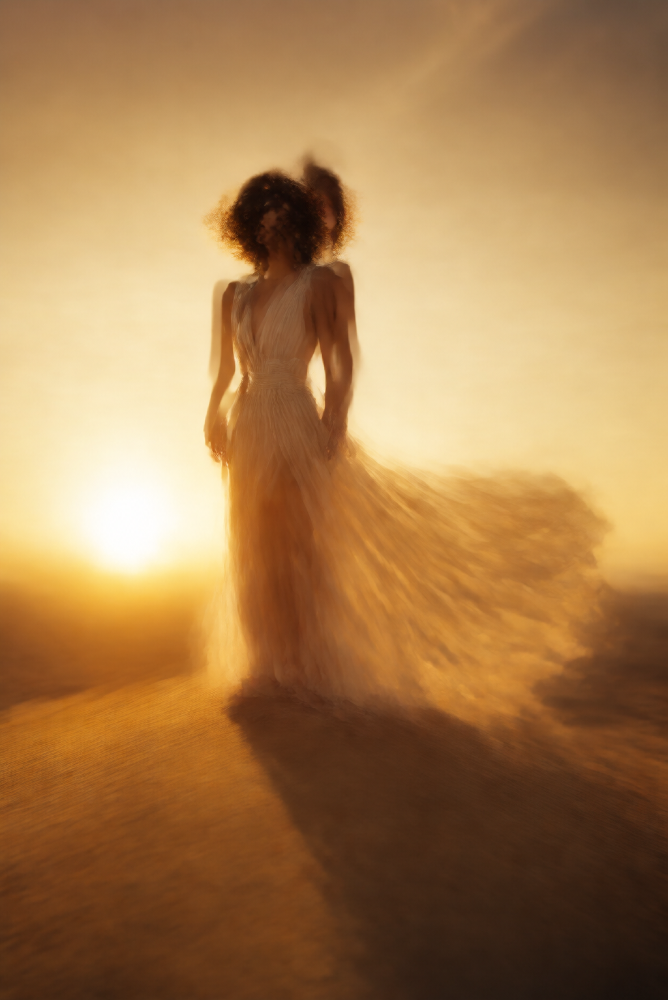

# Hermes Daily Image Training

> AI-generated photography that looks like photography — not AI art.

A battle-tested prompt engineering methodology for photorealistic AI image generation. **9 styles, 9/9 hits.** Built for [Hermes Agent](https://hermes-agent.nousresearch.com) with OpenAI Codex (gpt-image-2-high) and xAI Grok.

---

## The Problem

After accumulating 721 curated prompts, 348 professional photography references, and techniques from master photographers, our images got **worse**, not better.

| What we were doing | Result |
|---|---|
| "Gregory Crewdson cinematic staging" | Plastic, staged, AI-feeling |
| "Rembrandt triangle light, Kodak Portra 400" | Blurry, artificial, "找不到感觉" |
| "Sebastião Salgado documentary power" | Uncanny, fake skin, "太假" |

## The Insight

**AI doesn't understand art references — it understands camera physics.**

When you say "Annie Leibovitz dramatic portrait", the model tries to paint "a Leibovitz-style image" — stylized, interpreted, second-hand.

When you say "Canon EOS R5, 85mm f/1.2, ISO 800, single softbox 45°", the model renders through physical constraints: shallow depth of field from f/1.2, clean grain from ISO 800, soft directional shadow from a 45° softbox.

**Don't direct the artist. Rent it a lens.**

---

## Before → After

| Before (Art Reference Style) | After (Camera Physics Style) |
|---|---|
| "Gregory Crewdson cinematic staging, golden hour backlight, Kodak Portra 400" | "Canon EOS R5, 85mm f/1.2, ISO 800, blue hour twilight, tungsten bulb above doorway" |
| Result: blurry, plastic, AI-feeling | Result: photorealistic, "很真实，非常棒" |




---

## The Formula

```
[ Scene + Subject ] + [ Natural Light ] + [ Camera + Lens + ISO ] + [ Skin/Texture Detail ] + [ Documentary Style Claim ]

⛔ NEVER: photographer names, "cinematic", "editorial", "staged", film stock names
✅ ALWAYS: camera model, focal length, aperture, ISO, natural light description
```

## 9 Verified Styles

All verified on 2026-08-05 with OpenAI Codex (gpt-image-2-high). One shot each, no retries.

### Portraits & People

| # | Style | Lens + ISO | Light | Best For |
|---|-------|-----------|-------|----------|
| 1 | **Photojournalism** | R5 85/1.2, ISO 800-1600 | Window, overcast, tungsten | Candid portraits, street, documentary |
| 2 | **Commercial Fashion** | Hasselblad 80/1.9, ISO 100 | North window, indirect daylight | Clean editorial, product+model |
| 3 | **Travel Documentary** | Leica M11 35/1.4, ISO 400-800 | Afternoon sun through leaves | National Geographic feel |
| 5 | **Street Snapshot** | Ricoh GR III 28/2.8, ISO 1600-3200 | Mixed city light, no flash | Raw, gritty, Daido Moriyama energy |
| 6 | **Studio Portrait** | R5 50/1.2, ISO 100 | Single softbox 45°, white seamless | Professional headshots |

### Nature & Wildlife

| # | Style | Lens + ISO | Light | Best For |
|---|-------|-----------|-------|----------|
| 4 | **Minimalist Landscape** | Sony 24/1.4, ISO 100, tripod | Pre-dawn long exposure 30s | Serene, atmospheric |
| 7 | **Nature Landscape** | Sony 24-70/2.8@35, ISO 200 | Dawn first light, mist | Grand vistas, mountains, water |
| 8 | **Wildlife** | Sony 400/2.8 + 1.4x TC, ISO 800 | Rim light, frost, golden hour | Animals in habitat |
| 9 | **Insect Macro** | R5 100/2.8 macro 1:1, ISO 400 | Morning filtered through leaf | Extreme close-up, detail |

### Gallery

| Photojournalism | Wildlife | Macro |
|---|---|---|
|  |  |  |

| Travel | Landscape |
|---|---|
|  |  |

---

## Negative Keywords

### People + Animals + Macro
```
NOT CGI, 3D render, airbrushed, plastic skin, waxy, doll-like,
beauty filter, over-sharpened, HDR glow, cinematic lighting,
staged portrait, fashion editorial, digital art
```

### Pure Landscape
```
NOT CGI, 3D render, HDR, over-sharpened, oversaturated,
digital art, cinematic
```

---

## Auto-Switch Rules

Codex (gpt-image-2-high) is default. Switch to xAI Grok immediately when:

1. Light subject + backlight + light background (guaranteed blur)
2. Black & white realistic portraits (AI facial detail inherently weak)
3. Reflective surfaces (salt flats, water mirrors, glass)

Switch back to Codex after the Grok shot.

---

## The Architecture

```
┌─────────────────────────────────────────┐
│ LAYER 1: Generation Prompt (≤150 words) │
│ Scene + Light + Camera + Skin + Negatives│
│ ⛔ No artist names, film stocks, styles  │
├─────────────────────────────────────────┤
│ LAYER 2: Knowledge Base (Agent only)     │
│ 721 prompts, Larousse 348, master tips   │
│ → Agent translates ideas into Layer 1    │
├─────────────────────────────────────────┤
│ LAYER 3: Negative Keywords               │
│ Tell AI what NOT to do, not HOW to do it │
└─────────────────────────────────────────┘
```

**The 721 prompts aren't instructions — they're inspiration.** The agent reads them, picks scenes and compositions, then translates into camera-forward language for the model.

---

## Version History

| Version | Date | Change |
|---------|------|--------|
| v5.1.0 | 2026-08-05 | 9-style complete matrix, all verified |
| v5.0.0 | 2026-08-05 | Photojournalism approach: drop art references, use camera specs |
| v4.0.0 | 2026-08-04 | Art-feel v2.0 framework (superseded by v5) |

---

## Credits

Skill built for [Hermes Agent](https://hermes-agent.nousresearch.com) by Nous Research.  
Methodology discovered through iterative testing on 2026-08-05.
